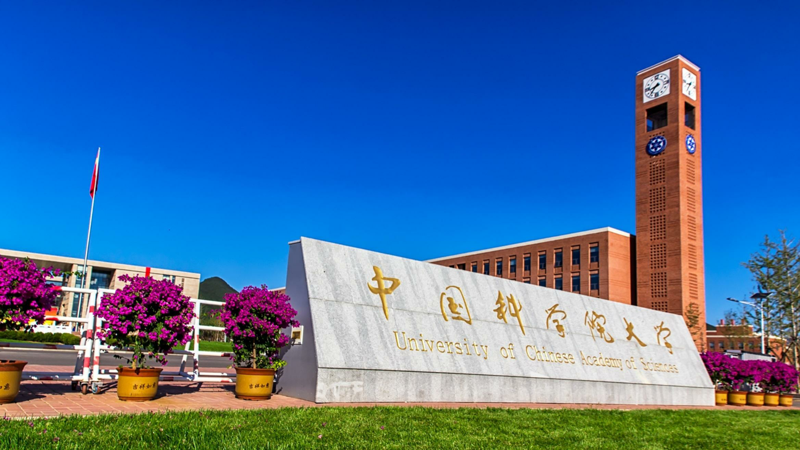
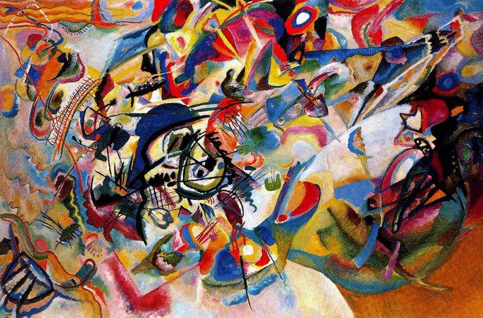

# 基于深度学习的图像风格迁移

## 图像风格迁移

指定一幅输入图像作为基础图像，也被称做内容图像；同时指定另一幅或多幅图像作为风格图像，最终的目的是输出图像可以分别结合输入图像的内容和风格，也就是我们希望结果图像可以在内容上与内容图像相似，在风格上与风格图像相似。

图像风格迁移这一问题并没有严格的数学定义。具体说来，这是由于图像的"风格"这一词汇本身就没有严格的定义，它包含了丰富的含义，可以是指图像的颜色、纹理和画家的笔触，甚至是图像本身所表现出的某些难以言表的成分。但另一方面，人类尤其是经过训练的专业人员却可以充分地感受和描述图像风格。因此图像风格迁移这一问题也和人类认知相关。

## 内容损失函数

以 VGG19 网络结构的 conv4_2 的输出作为图像的内容表示，定义内容损失函数。

## 风格损失函数

使用 conv1_1, conv2_1, conv3_3, conv4_4, conv5_1 五个卷积层进行风格损失函数的计算，不同的权重会导致不同的迁移效果。

## 总体损失函数

总体损失函数即内容损失函数和风格损失函数的加权，不同的权重会导致不同的迁移效果。

## 算法原理

在风格表示上，由每一层输出的 feature_map 所得到的 Gram 矩阵可以作为图像风格的良好表示。具体计算方法为：将某一层输出的 N 个 feature_map 分别拉成向量，Gram 矩阵的元素为 feature_map 向量之间的内积(即 correlation)，具体计算公式如下：

其中 l 表示第 l 层，G 为 Gram 矩阵，Fi 和 Fj 为第 i 个和第 j 个 feature map 向量。

在解决了图像内容和风格的表示之后，接下来就是如何衡量与内容和风格之间的相似性，并将这一问题转化为优化问题求解。假定我们希望得到的最终合成图像为 O，输入的内容图像为 I，风格图像为 S(假设只有一副风格图像)。为了使 O 与 I 的内容相似，我们有以下损失函数：

为了使 O 与 S 的风格相似，我们有以下损失函数：

其中，G 代表 Gram 矩阵，F 代表 feature map，l 表示第 l 层，Nl 代表 l 层中有 Nl 个 feature map，Dl 表示 feature map 的尺寸。

最终我们会得到以下总的损失函数:

在本问题中，我们需要求解目标是图像 X，而不是神经网络的参数。因此求解过程并没有神经网络的训练过程（即，该问题并不是机器学习通常的“训练-测试”流程，而只是一个普通的迭代求解过程。迭代结束，就得到目标图像。这也导致了该算法的运行速度比较慢。），只是在计算损失函数对 X 的梯度时，仍然需要借助于深度学习框架的高性能。这一点希望读者注意。

## VGG19 模型结构

## 运行结果

### 内容图像

### 风格图像

### 结果图

